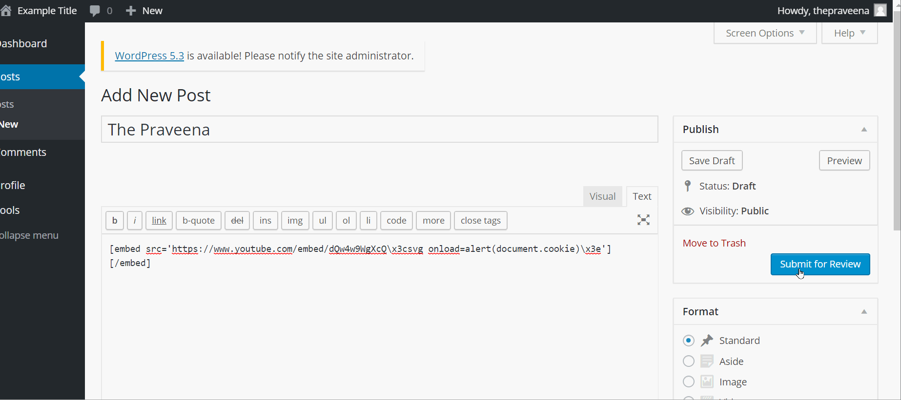

# Week-7-and-8-Codepath
# Project 7 - WordPress Pentesting

Time spent: **18** hours spent in total

> Objective: Find, analyze, recreate, and document **five vulnerabilities** affecting an old version of WordPress

## Pentesting Report

1. (Required) Vulnerability Name or ID
  - [x] Summary: 
    - Vulnerability types:XSS
    - Tested in version:4.2
    - Fixed in version: 4.2.1
  - [x] GIF Walkthrough: 
     - 
  - [x] Steps to recreate: 
        - i. Post the text to comment : [Link 1](https://github.com/pshrest001/Week-7-and-8-Codepath/blob/master/xss_file.txt)
        - ii. After the approval of the comment, you can see the execution of the code 
  - [ ] Affected source code:
    - [Link 1] (https://github.com/pshrest001/Week-7-and-8-Codepath/blob/master/xss_file.txt)
    - [Link 2] (https://www.exploit-db.com/exploits/36844)
    - [Link 3] (https://klikki.fi/adv/wordpress2.html)
    - [Link 4] (https://packetstormsecurity.com/files/131644/)
1. (Required) XSS in YouTube URL Embeds
  - [x] Summary: 
    - Vulnerability types: CSRF
    - Tested in version: 4.2
    - Fixed in version: 4.7.3 
  - [x] GIF Walkthrough: 
      - 
  - [x] Steps to recreate: 
      - i. The post should be uploaded only under 
          - Author
          - Contributor 
      - ii. The youtube embed snippet : 
        -[Link 1] (https://github.com/pshrest001/Week-7-and-8-Codepath/blob/master/embed.txt)
        
  - [x] Affected source code:
    - [Link 1] (https://cve.mitre.org/cgi-bin/cvename.cgi?name=CVE-2017-6817)
    - [Link 2] (https://nvd.nist.gov/vuln/detail/CVE-2017-6817)
1. (Required) XSS via Media File Metadata
  - [-] Summary: 
    - Vulnerability types: XSS
    - Tested in version: 4.2
    - Fixed in version: 4.2.13
  - [x] GIF Walkthrough: 
      - 
  - [x] Steps to recreate: 
      - i. Upload any kind of picture with jpg tag 
      - [Link 1] (https://github.com/pshrest001/Week-7-and-8-Codepath/blob/master/media.txt) 
      - ii. Include as attachment 
      - iii. Post it as any alighnment you ike 
      - iv. YOU NEED TO POST AS ADMIN 
  - [x] Affected source code:
    - [Link 1](https://core.trac.wordpress.org/browser/tags/version/src/source_file.php)
1. (Optional) Vulnerability Name or ID
  - [] Summary: 
    - Vulnerability types:
    - Tested in version:
    - Fixed in version: 
  - [ ] GIF Walkthrough: 
  - [ ] Steps to recreate: 
  - [ ] Affected source code:
    - [Link 1](https://core.trac.wordpress.org/browser/tags/version/src/source_file.php)
1. (Optional) Vulnerability Name or ID
  - [ ] Summary: 
    - Vulnerability types:
    - Tested in version:
    - Fixed in version: 
  - [ ] GIF Walkthrough: 
  - [ ] Steps to recreate: 
  - [ ] Affected source code:
    - [Link 1](https://core.trac.wordpress.org/browser/tags/version/src/source_file.php) 

## Assets

List any additional assets, such as scripts or files
- i. XSS Comment 
- ii. Pusheen 

## Resources

- [WordPress Source Browser](https://core.trac.wordpress.org/browser/)
- [WordPress Developer Reference](https://developer.wordpress.org/reference/)

GIFs created with [LiceCap](http://www.cockos.com/licecap/).

## Notes
- The command root@kali:~# wpscan --url http://wpdistillery.vm --random-agent returned Scan Aborted: invalid option: --random-agent
- for the file name for the jpg tag, windows does not allow some special characters in file names such as /, |, (, ) etc so you can manually change it after uploading in word press

## License

    Copyright [2019] [Praveena Shrestha]

    Licensed under the Apache License, Version 2.0 (the "License");
    you may not use this file except in compliance with the License.
    You may obtain a copy of the License at

        http://www.apache.org/licenses/LICENSE-2.0

    Unless required by applicable law or agreed to in writing, software
    distributed under the License is distributed on an "AS IS" BASIS,
    WITHOUT WARRANTIES OR CONDITIONS OF ANY KIND, either express or implied.
    See the License for the specific language governing permissions and
    limitations under the License.
